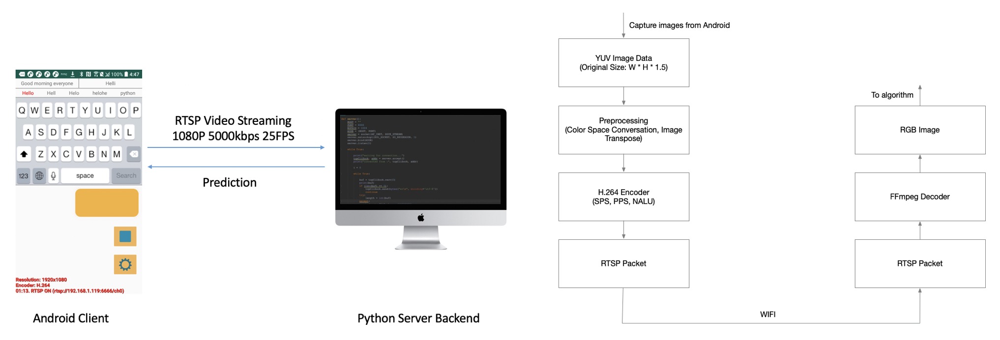

# android-camera-streamer
This project implemented image frame capturing in real time and video-streaming to a remote server in high FPS and resolution. For experimental purposes. 


# Backend Decoder
Using ffmpeg framework that was defaultly embedded in opencv to decode video stream like common IPCamera:
```
import cv2
streaming_url = 'rtsp://{your ip}:{your port}/ch0'
cap = cv2.VideoCapture(streaming_url, cv2.CAP_FFMPEG)
while cap.isOpened():
  ret, frame = cap.read()
  # process your frame here
```
